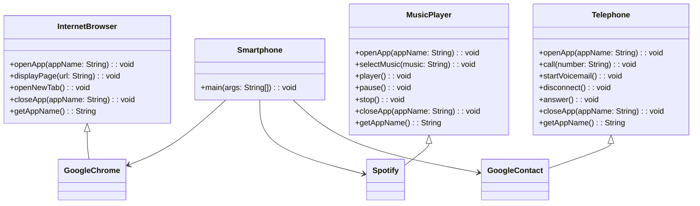

## UML

```mermaid
classDiagram
    Smartphone --> GoogleChrome
    Smartphone --> Spotify
    Smartphone --> GoogleContact

    class Smartphone {
        +main(args: String[]): void
    }

    class InternetBrowser {
        +openApp(appName: String): void
        +displayPage(url: String): void
        +openNewTab(): void
        +closeApp(appName: String): void
        +getAppName(): String
    }

    class GoogleChrome {
    }

    InternetBrowser <|-- GoogleChrome

    class MusicPlayer {
        +openApp(appName: String): void
        +selectMusic(music: String): void
        +player(): void
        +pause(): void
        +stop(): void
        +closeApp(appName: String): void
        +getAppName(): String
    }

    class Spotify {
    }

    MusicPlayer <|-- Spotify

    class Telephone {
        +openApp(appName: String): void
        +call(number: String): void
        +startVoicemail(): void
        +disconnect(): void
        +answer(): void
        +closeApp(appName: String): void
        +getAppName(): String
    }

    class GoogleContact {
    }

    Telephone <|-- GoogleContact
```